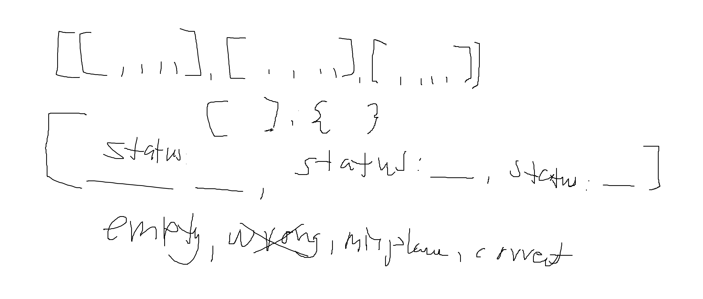
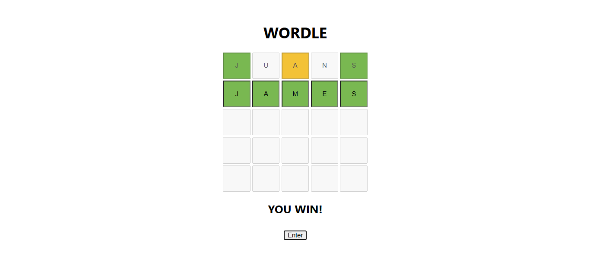

# WORDLE
`October 22, 2025 | February 07, 2026` `JavaScript` `ReactJS` `NextJS` 
To test my skills in arrays, map, state, and logical thinking. Don’t look at my code, you’ll be shocked.

**Use of ChatGPT**
- Looking for a 5-letter words API
- Fix missing line: newBoxes[1] = updateSecondRow

